# LABGRAM

## Índice

* [1. Definición del proyecto](#1-definición-del-proyecto)
* [2. Historias de usuarios](#2-historias-de-usuarios)
* [3. Prototipos de proyecto](#3-prototipos-de-proyecto)
* [4. Desarrollo del proyecto](#4-desarrollo-del-proyecto)
* [5. Test unitarios](#5-test-unitarios)
* [6. Planificación](#6-planificación)
* [7. Material utilizado](#7-material-utilizado)

***

## 1. Definición del proyecto

Nuestro proyecto LABGRAM nacio de la necesidad de compilar ejercicios de programación de nuestro bootcamp, al realizar esta actividad semanalmente, creimos necesario un espacio donde compartir las posibles soluciones a estos ejercicios y asi aprender en comunidad.
Esta pagina esta desarrollada como una SPA [Single-page Application (SPA)](https://es.wikipedia.org/wiki/Single-page_application)
[_responsive_](https://curriculum.laboratoria.la/es/topics/css/02-responsive) (con más de una vista / página).
Esta app utilizara los servicios de Firebase para autenticarse, crear registros, escribir post, editar, borrar, etc.

## 2. Historias de usuarios

Para este proyecto realizamos encuesta a traves de formulario. 
Registramos las necesidades y como poder aceptarlas como finalizadas.
Recopilamos siete historias de usuario, que podemos ver a continuación, tambien dejamos el link con archivo en drive para ver detalles.

[Link historias de usuarios](https://docs.google.com/spreadsheets/d/1ytLTevb_3QAbttfVcF-lRlaGXfcJpWaV/edit?usp=sharing&ouid=105057202485758423586&rtpof=true&sd=true)

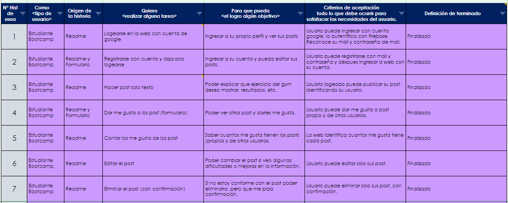

**Historia de usuario N°1**

* *Quiero poder registrarme en la pagina con mi cuenta de Google*
* *Para que cuando ingrese, reconozca mi mail y contraseña, sin necesidad de registrarme en la misma pagina.*
* *Criterios de aceptación: el usuario puede ingresar al home y seguir a iniciar sesion con google, sin necesidad de pasar por paso de registrarse, web reconoce su mail y contraseña de google.*

**Historia de usuario N°2**

* *Quiero poder registrarme en la pagina.*
* *Para que cuando ingrese mis datos, estos queden almacenados en la web.*
* *Criterios de aceptación: el usuario puede ingresar al home y seguir a registarse con su mail y contraseña, esto podra hacerlo solo una vez por cuenta creada, posteriormente solo debera ingresar a traves de iniciar sesión, solo se aceptara un usuario por mail.*

**Historia de usuario N°3**

* *Quiero escribir mis propios post.*
* *Para que cuando ingrese con mi cuenta, poder hacer post y que queden guardados en la web.*
* *Criterios de aceptación: el usuario al ingresar a su cuenta, podra escribir sus post, cuantos quiera, y quedaran almacenados, con fecha, hora y su mail de usuario como firma.*

**Historia de usuario N°4**

* *Quiero dar me gusta a mis propios post y de otros usuarios.*
* *Para que cuando ingrese con mi cuenta, poder dejar me gusta a mis post favoritos.*
* *Criterios de aceptación: el usuario al ingresar a su cuenta, podra leer sus propios post y de otros usuarios y segun su gusto dar o quitar me gusta a publicaciones favoritas.*

**Historia de usuario N°5**

* *Quiero identificar cuantos me gusta tiene cada post.*
* *Para que cuando ingrese con mi cuenta, poder identificar cuantos me gusta tiene cada post, ya sean propios o de otros usuarios.*
* *Criterios de aceptación: el usuario al ingresar a su cuenta, podra ver cantidad de me gusta de sus propios post o los de otros usuarios.*

**Historia de usuario N°6**

* *Quiero editar post.*
* *Para que cuando ingrese con mi cuenta, pueda editar post.*
* *Criterios de aceptación: el usuario al ingresar a su cuenta, podra editar solo sus propios post, esta opción solo estara disponible en sus propias publicaciones, sin opcion de editar los de otros usuarios.*

**Historia de usuario N°7**

* *Quiero borrar post.*
* *Para que cuando ingrese con mi cuenta, pueda borrar post.*
* *Criterios de aceptación: el usuario al ingresar a su cuenta, podra borrar solo sus propios post, esta opción solo estara disponible en sus propias publicaciones, sin opcion de borrar los de otros usuarios. Esta opción tiene pregunta de confirmación de borrado.*

## 3. Prototipos de proyecto

Teniendo entendidas las historias de usuarios y desarrollando nuestra creatividad, comenzamos a diseñar nuestros prototipos de diseño en Figma.

**Prototipo baja fidelidad**
https://miro.com/app/board/uXjVMCL4inQ=/?share_link_id=853420030999
° 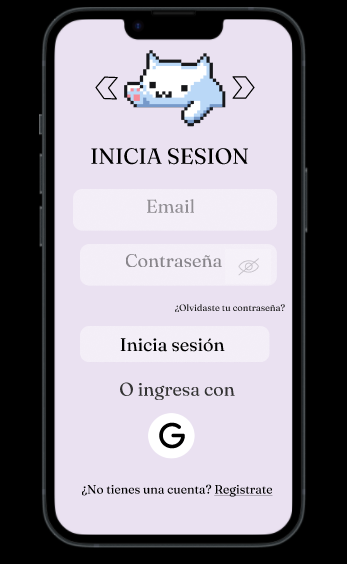

**Prototipo alta fidelidad**

° 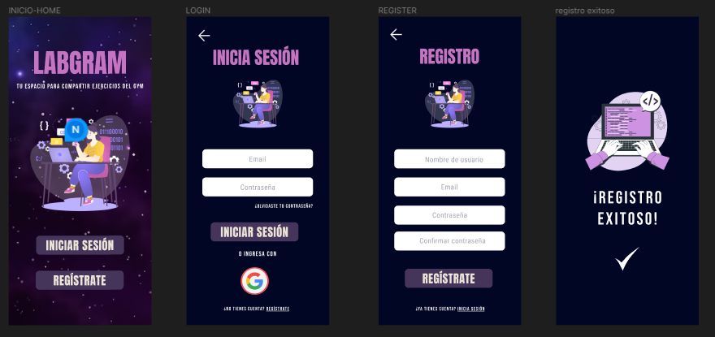

Dejamos el Link Figma de Prototipos alta y baja fidelidad para su revisión en detalle.

[Link Figma](https://www.figma.com/file/dbAofymZlDqIP3kV73uvzZ/Social-Network---Labgram-(tu-gym%2C-nuestro-gym)?type=design&node-id=0-1&mode=design&t=3jaGlObclraCqkPu-0)

## 4. Desarrollo del proyecto

Nuestro proyecto fue realizado 100% responsive para Iphone, IpadMini y Escritorio, en imagenes de login (en punto 4.2) veremos estas vistas. 
Tambien queremos contarte que al realizar tu proceso ya sea en login o registro, tenemos distintas ventanas (snackbar) que te darán pistas si estas cometiendo algun error, como por ejemplo en la siguiente imagen de registro donde nos indica que la contraseña ingresada no corresponda.

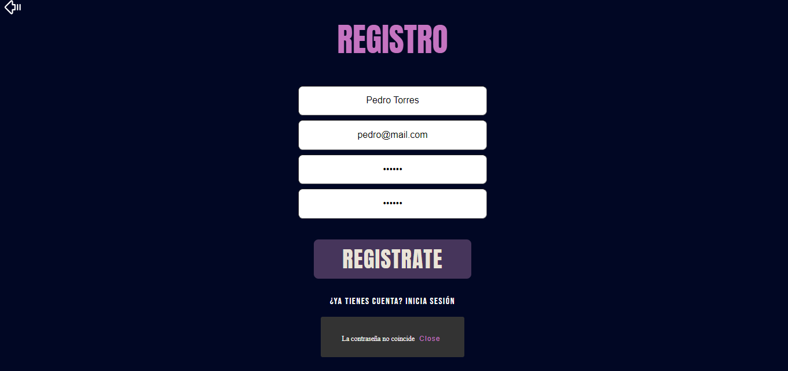

**4.1 Home LABGRAM**

* Este es el inicio de nuestra web, aqui tienes dos opciones:
  * Iniciar Sesión, ya sea con google o con una cuenta creada anteriormente.
  * Registrarte, si eres usuario nuevo y quieres crear una cuenta.

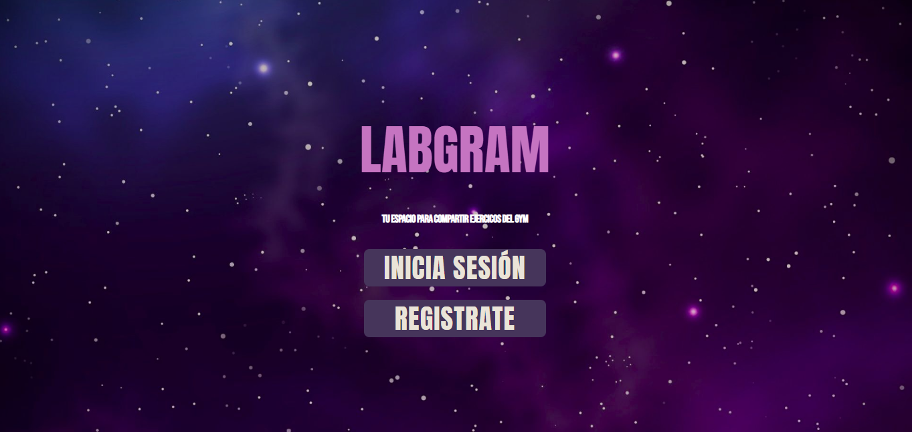

**4.2 Login LABGRAM**

* Aqui te mostramos las tres vistas principales disponibles (Iphone, Ipadmini, Escritorio)
* En esta vista puedes ingresar con tu cuenta, si es que tienes una, si no, puedes registarte en la parte inferior de la pantalla.
* Tambien podras ingresar a la web con tu cuenta de google.
* En la parte superior izquierda encontraras un icono para volver al home.

°Iphone

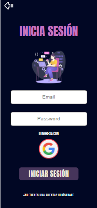

°Ipadmini

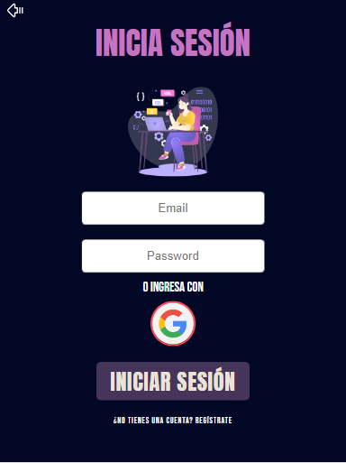

°Escritorio

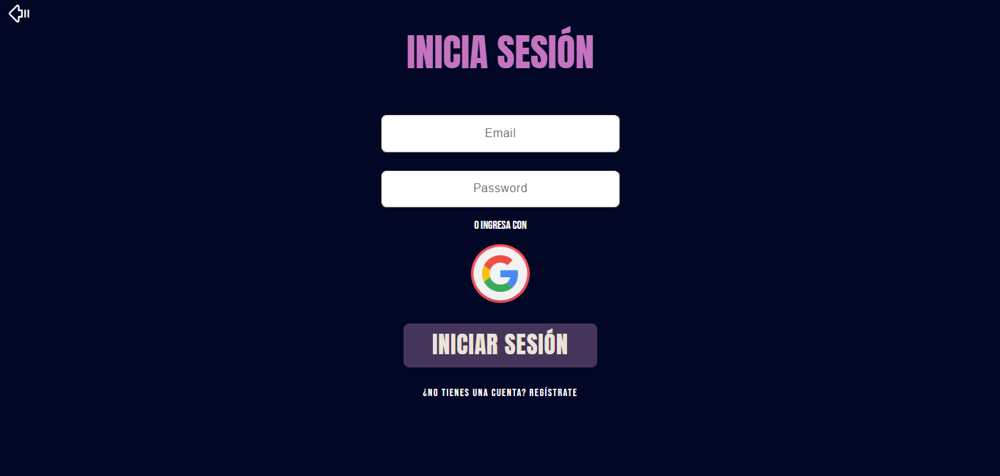

**4.3 Registro LABGRAM**

* En la pagina de registro, puedes ingresar tu nombre, mail y contraseña de preferencia, este paso se realiza solo una vez, en el futuro con esta cuenta podras ingresar en Iniciar sesion (login).
* Si ya tienes una cuenta puedes ingresar en la parte inferior, donde indica ir a Iniciar sesión.
* En la parte superior izquierda encontraras un icono para volver al home.
* Una vez registrado nuestra web te dara el mensaje exitoso y podras ingresar al feed.

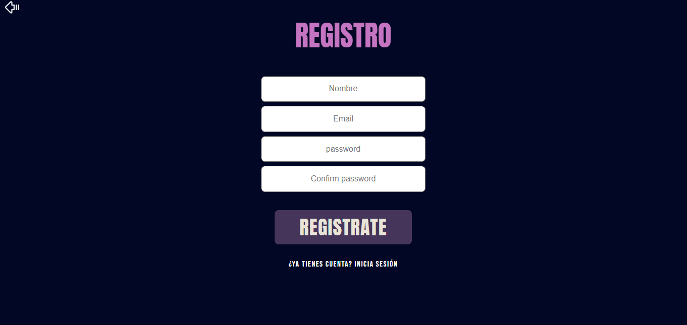

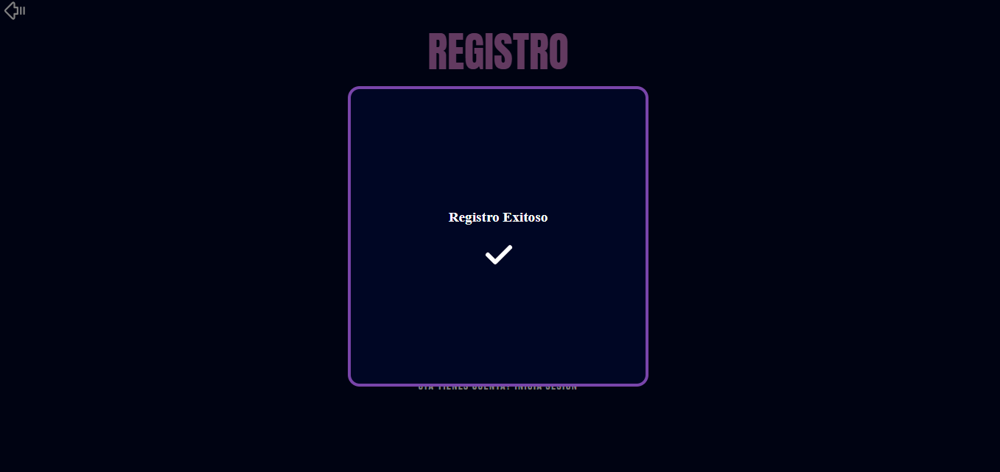

**4.4 Feed LABGRAM**

* Llegamos a nuestra pagina de publicaciones o post, aqui la web te dara la bienvenida reconociendo tu mail.
* Podras ver el cuadro donde publicar tus ejercicios de GYM y dar a compartir.
* Tambien podras ver en la parte superior derecha un icono para salir de la web, una vez hecho el click deberas logearte nuevamente.

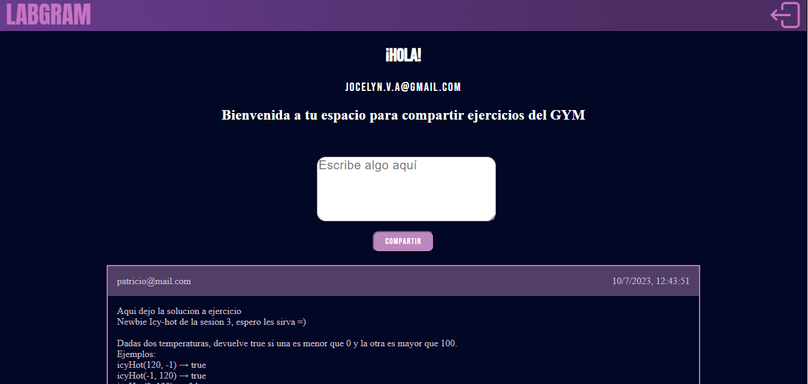

**4.5 Feed Post LABGRAM**

Detalles de las publicaciones/posts
* Cada post tiene tu mail logeado.
* El post indica fecha y hora de publicación.
* Puedes ver el corazón de los me gusta para que puedas dar o quitar a los posts.
* Junto al corazon podras ver el contador de me gusta, asi sabras cuantos tiene cada publicación.
* Solo podras ver las opciones de editar y borrar si el post te pertenece como usuario logeado, asi nadie podra editar ni borrar tus post.

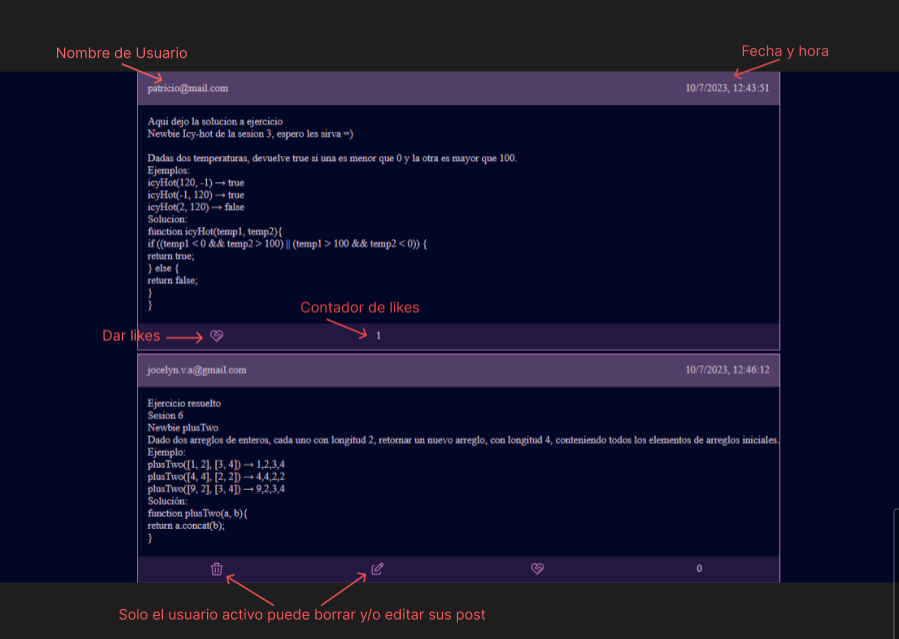

**4.6 Feed Editar y Borrar LABGRAM**

* Al pulsar el boton editar, un modal te dara las instrucciones para modificar lo que desees de tu post.

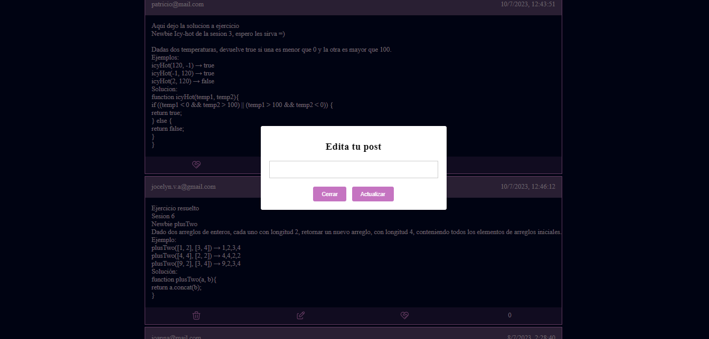

* Al pulsar el boton borrar, un modal te preguntara si estas seguro de borrar, por si cometiste un error al hacer click.

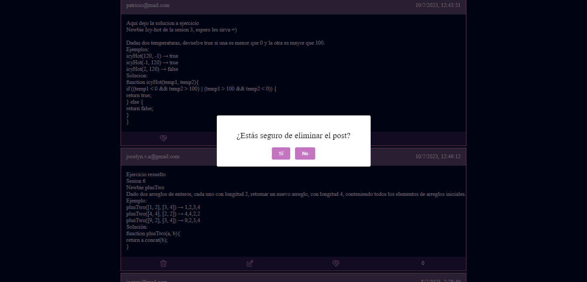

## 5. Test unitarios

Para nuestro proyecto realizamos test unitarios, para corroborar que nuestra web es confiable es sus funciones. El detalle de pruebas lo mostramos a continuación:

* crearUsuarioYContraseña
  ° √ es una función
  ° √ deberia llamar a la función createUserWithEmailAndPassword cuando es ejecutada
  ° √ deberia devolver undefined
* loginUsuarioYContraseña
  ° √ es una función
  ° √ debe dar error cuando no funciona
  ° √ deberia llamar a la función signInWithEmailAndPassword cuando es ejecutada
* loginGoogle
  ° √ es una función
  ° √ deberia llamar a la función signInWithPopup cuando es ejecutada
* crearPost
  ° √ es una función
  ° √ deberia llamar a la funcion addoc cuando es ejecutada
  ° √ deberia dar error cuando no se agrega el post
* obtenerTodosLosPost
  ° √ es una función
  ° √ deberia llamar a la funcion onSnapshot cuando es ejecutada
  ° √ deberia dar error cuando no se agregan los posts
* borrarPost
  ° √ es una función
  ° √ deberia llamar a la funcion deleteDoc cuando es ejecutada
  ° √ deberia dar error cuando se eliminen los posts
  ° √ deberia borrar el post
* editarPost
  ° √ es una función
  ° √ deberia llamar a la funcion updateDoc cuando es ejecutada
  ° √ deberia editar el post
+ likesPost
  ° √ es una función
  ° √ deberia dar like al post
  ° √ deberia llamar a la funcion updateDoc cuando es ejecutada
* removeLike
  ° √ es una función
  ° √ deberia quitar el like del post
  ° √ deberia llamar a la funcion updateDoc cuando es ejecutada
* usuarioLogeado
  ° √ es una función
  ° √ debería devolver el correo electrónico del usuario actual
* usuarioLogeadoRegister
  ° √ es una función
  ° √ debería devolver el correo electrónico del usuario
* currentUserInfo
  ° √ es una función
  ° √ deberia devolver la información del usuario actual
    
Tenemos un 85.71% de funciones testeadas, segun detalle:

## 6. Planificación

Durante todo el proyecto utilizamos nuestra planificación de tareas en Trello, esta herramienta nos permitio realizar diseño paso a paso, teniendo a mano recursos y actividades para cada sprint.

Link Trello [Link Trello](https://trello.com/b/YE89Cj6d/social-network)

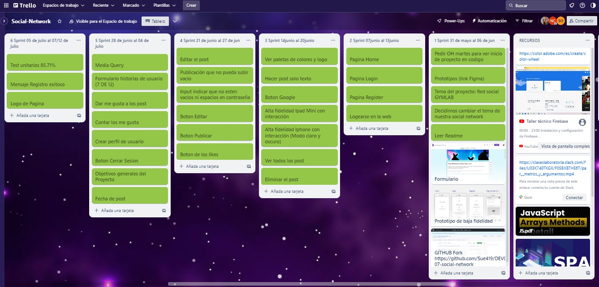

## 7. Material utilizado

### Mobile first

El concepto de [_mobile first_](https://www.mediaclick.es/blog/diseno-web-responsive-design-y-la-importancia-del-mobile-first/)
hace referencia a un proceso de diseño y desarrollo donde partimos de cómo se ve
y cómo funciona la aplicación en un dispositivo móvil primero, y más adelante se
ve como adaptar la aplicación a pantallas progresivamente grandes y
características específicas del entorno desktop. Esto es en contraposición al
modelo tradicional, donde primero se diseñaban los websites (o webapps) para
desktop y después se trataba de _arrugar_ el diseño para que entre en pantallas
más chicas. La clave acá es asegurarse de que desde el principio diseñan usando
la vista _responsive_ de las herramientas de desarrollador (developer tools) del
navegador. De esa forma, partimos de cómo se ve y comporta la aplicación en una
pantalla y entorno móvil.

### Múltiples vistas

En proyectos anteriores nuestras aplicaciones habían estado compuestas de una
sola _vista_ principal (una sóla _página_). En este proyecto se introduce la
necesidad de tener que dividir nuestra interfaz en varias _vistas_ o _páginas_
y ofrecer una manera de navegar entre estas vistas. Este problema se puede
afrontar de muchas maneras: con archivos HTML independientes (cada uno con su
URL) y links tradicionales, manteniendo estado en memoria y rederizando
condicionalmente (sin refrescar la página), [manipulando el historial del
navegador](https://developer.mozilla.org/es/docs/DOM/Manipulando_el_historial_del_navegador)
con [`window.history`](https://developer.mozilla.org/es/docs/Web/API/Window/history).
En este proyecto te invitamos a explorar opciones y decidir una opción
de implementación.

### Escritura de datos

En los proyectos anteriores hemos consumido (leído) datos, pero todavía no
habíamos escrito datos (salvar cambios, crear datos, borrar, ...). En este
proyecto tendrás que crear (salvar) nuevos datos, así como leer, actualizar y
modificar datos existentes. Estos datos se podrán guardar de forma remota
usando [Firebase](https://firebase.google.com/).

Para usar Firebase hay que crear un proyecto en la consola de Firebase e
instalar la dependencia `firebase` utilizando `npm`.
Lee [las instrucciones paso a paso aqui](https://firebase.google.com/docs/web/setup).

Otras:

* [Modulos: Export](https://developer.mozilla.org/es/docs/Web/JavaScript/Referencia/Sentencias/export)
* [Modulos: Import](https://developer.mozilla.org/es/docs/Web/JavaScript/Referencia/Sentencias/import)
* [Diseño web, responsive design y la importancia del mobile first - Media Click](https://www.mediaclick.es/blog/diseno-web-responsive-design-y-la-importancia-del-mobile-first/)
* [Mobile First: el enfoque actual del diseño web móvil - 1and1](https://www.1and1.es/digitalguide/paginas-web/diseno-web/mobile-first-la-nueva-tendencia-del-diseno-web/)
* [Mobile First - desarrolloweb.com](https://desarrolloweb.com/articulos/mobile-first-responsive.html)
* [Mobile First Is NOT Mobile Only - Nielsen Norman Group](https://www.nngroup.com/articles/mobile-first-
* [Modulos: Import](https://developer.mozilla.org/es/docs/Web/JavaScript/Referencia/Sentencias/import)
* [Diseño web, responsive design y la importancia del mobile first - Media Click](https://www.mediaclick.es/blog/diseno-web-responsive-design-y-la-importancia-del-mobile-first/)
* [Mobile First: el enfoque actual del diseño web móvil - 1and1](https://www.1and1.es/digitalguide/paginas-web/diseno-web/mobile-first-la-nueva-tendencia-del-diseno-web/)
* [Mobile First - desarrolloweb.com](https://desarrolloweb.com/articulos/mobile-first-responsive.html)
* [Mobile First Is NOT Mobile Only - Nielsen Norman Group](https://www.nngroup.com/articles/mobile-first-not-mobile-only/)
